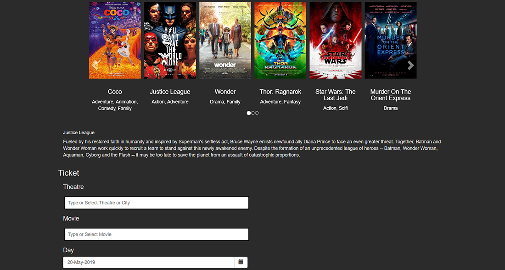

# Cinema Ticketing

A prototype for a movie selection and ticket purchase web app built using AngularJS. Uses Firebase's real-time database to store and fetch movie and theatre information. The objective was to present a more seamless user interface for purchasing movie tickets.

## Note
This project will not be maintained at the moment.
